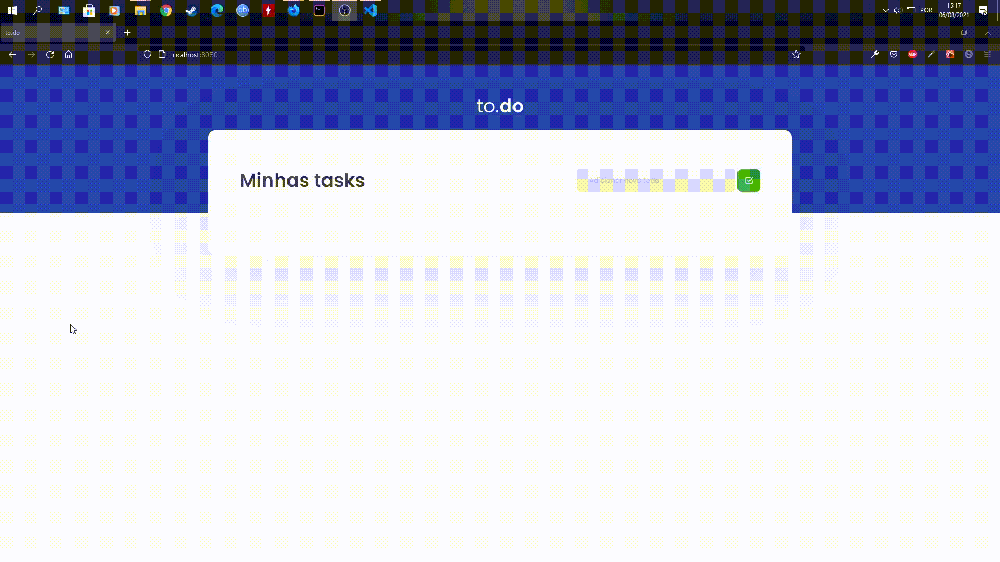

# :memo: todo-applist 

<h3 align="center">
  Desafio 01 - Conceitos do React
</h3>

## :pushpin: Sobre o desafio

Nesse desafio, foi criado uma aplicação para treinar o que aprendi durante as aulas.

O objetivo consiste em uma pequena aplicação de atividades a fazer, para treinar um pouco mais sobre manipulação do estado no React.

- Adicionar uma nova tarefa
- Remover uma tarefa
- Marcar e desmarcar uma tarefa como concluída

## :movie_camera: Demonstração 

## :computer: **Start** 

👇 Use o comando abaixo para _instalar_ todas as depêndencias

    yarn install

👇 Use o comando abaixo para _rodar_ o projeto

    yarn start
    
 ---
 ## :mag_right: Social medias

